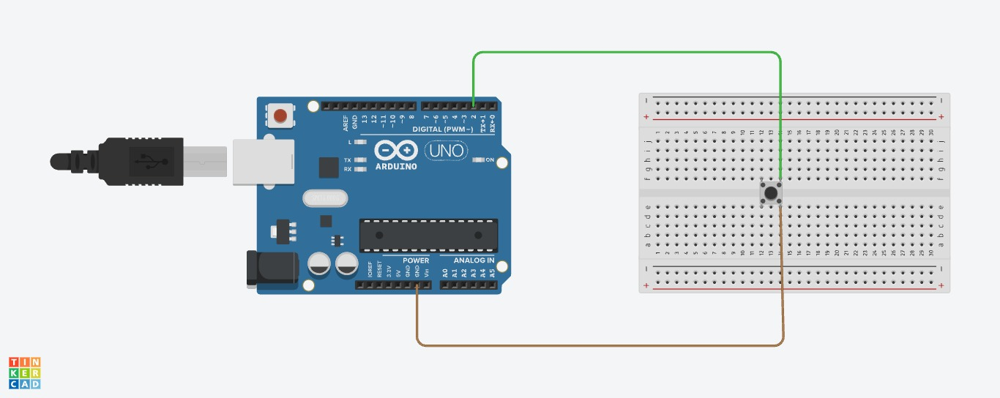
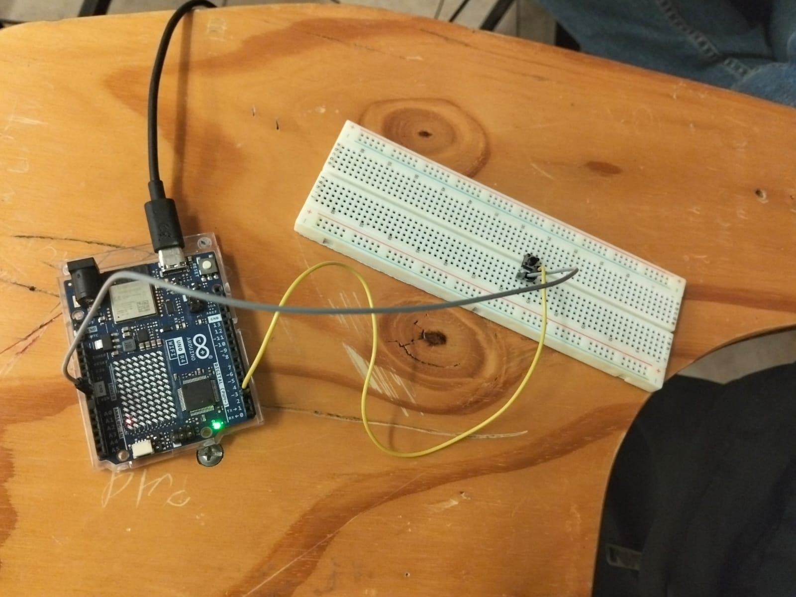

# Interrupciones Externas y Buffer Circular con Arduino UNO R4 WiFi

## Descripción

Este proyecto implementa un sistema de detección de eventos mediante un pulsador que simula el sensor de piezas de una banda transportadora. Se utiliza una interrupción externa para detectar cada pulsación, un buffer circular de tamaño fijo para almacenar los eventos y una animación no bloqueante en la matriz de LEDs integrada del Arduino UNO R4 WiFi.

## Objetivos de aprendizaje

* Comprender el funcionamiento de las interrupciones externas en Arduino.
* Utilizar un pulsador como simulación de un sensor de piezas.
* Implementar un buffer circular de tamaño fijo para almacenar eventos.
* Aplicar un filtro de rebote por software.
* Utilizar `millis()` para realizar una animación sin bloquear el programa.
* Comprender el funcionamiento de los contadores de escritura y lectura del buffer.

## Herramientas y material utilizado

* Arduino UNO R4 WiFi
* Arduino IDE
* Matriz de LEDs integrada en el Arduino UNO R4 WiFi
* Protoboard
* Pulsador
* Cables de conexión (jumpers)

## Diagrama

[Ver carpeta Diagrama](Diagrama)

## Código

El programa utiliza una interrupción externa en el pin 2 para detectar las pulsaciones del botón. Cada evento se almacena en un buffer circular de 16 posiciones, mientras la matriz de LEDs continúa ejecutando su animación mediante `millis()` sin detener el programa.

[Ver código Buffers.ino](Codigo/Buffers.ino)

## Reporte

El reporte explica el funcionamiento de las interrupciones externas, el buffer circular, el filtro de rebote, la animación no bloqueante y el procesamiento de los eventos detectados.

[Ver reporte](Reporte/Reporte.pdf)

## Video

[Ver video](https://youtu.be/R35mJx2twG4)

[Ver carpeta Video](Video)

## Conclusiones

La práctica permitió comprender el funcionamiento de las interrupciones externas, utilizando un pulsador como simulación de un sensor de piezas para detectar eventos de manera inmediata mientras el Arduino realiza otras tareas.

El uso del buffer circular permitió almacenar los eventos detectados y procesarlos posteriormente, mientras que el filtro de rebote ayudó a evitar registros múltiples ocasionados por una misma pulsación. Además, el uso de `millis()` permitió mantener la animación de la matriz de LEDs sin bloquear la ejecución del programa.

En conjunto, la práctica permitió relacionar las interrupciones, el almacenamiento mediante un buffer circular y la programación no bloqueante, comprobando cómo el Arduino puede responder a eventos externos sin detener las demás tareas que está realizando.

