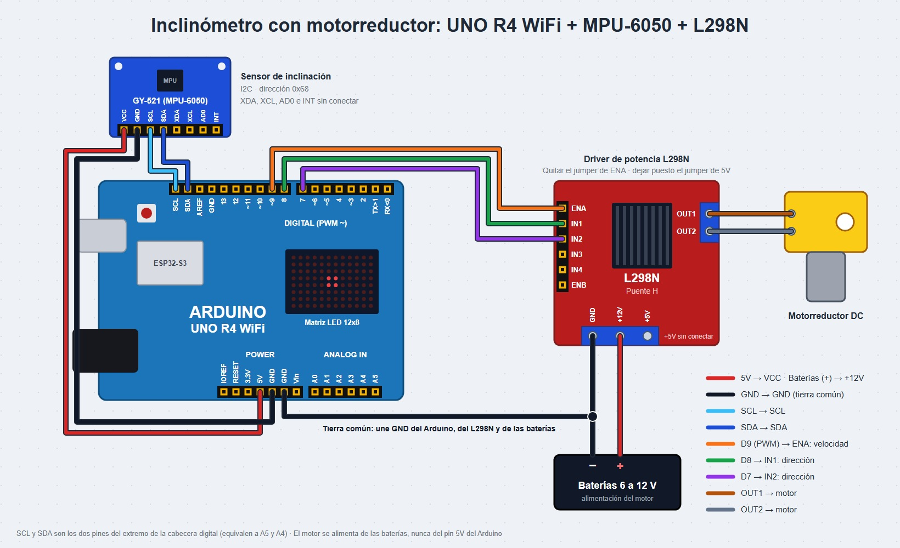
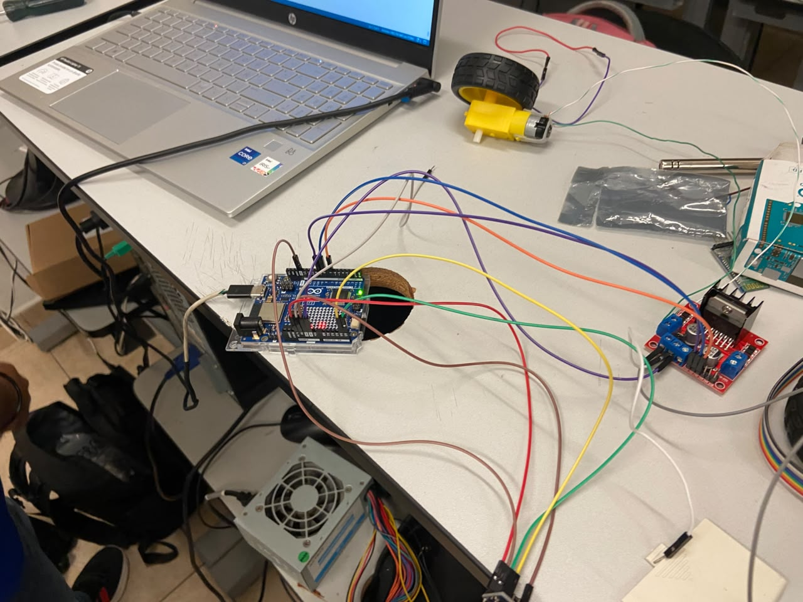
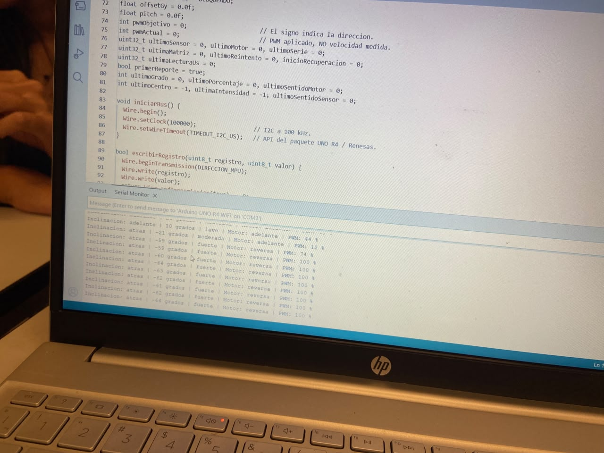

# Inclinómetro con control de motorreductor

## Descripción

En esta práctica (3.2.3) se implementó un sistema embebido que mide la inclinación frontal (pitch) de un sensor MPU-6050 y la utiliza para controlar la dirección y la velocidad de un motorreductor mediante un puente H L298N, con un Arduino UNO R4 WiFi.

El signo del ángulo decide el sentido de giro y su magnitud decide la velocidad: dentro de ±5° el motor permanece detenido, y entre 5° y 45° la velocidad crece en proporción a la inclinación. El ángulo se obtiene con un filtro complementario que combina el acelerómetro y el giroscopio, y los cambios de velocidad se aplican con una rampa de aceleración.

El programa utiliza `millis()` y `micros()` para ejecutar cuatro tareas sin bloquear la ejecución, e incluye un paro de seguridad que detiene el motor de inmediato cuando falla la lectura del sensor y se recupera solo cuando el sensor vuelve a responder.

## Integrantes

* Gabriel
* Javier
* Rosa

## Objetivos

* Leer el sensor MPU-6050 por I2C accediendo directamente a sus registros, sin librerías externas.
* Calcular la inclinación frontal combinando acelerómetro y giroscopio con un filtro complementario.
* Controlar la dirección y la velocidad de un motorreductor con un puente H L298N y una señal PWM.
* Aplicar una zona muerta, una velocidad mínima útil y una rampa de aceleración para que el motor responda de forma suave.
* Implementar un paro de seguridad ante fallas del sensor, con recuperación automática.
* Mostrar la inclinación en la matriz de LEDs y el estado del sistema en el Monitor Serie.
* Utilizar `millis()` para ejecutar varias tareas periódicas sin bloquear el programa.

## Herramientas y material utilizado

### Hardware

* Arduino UNO R4 WiFi
* Módulo GY-521 (sensor MPU-6050)
* Módulo puente H L298N
* Motorreductor DC con llanta
* Fuente de alimentación externa para el motor
* Cables de conexión
* Cable USB-C

### Software

* Arduino IDE
* Librería `Wire`
* Librería `Arduino_LED_Matrix`
* Monitor Serie

## Diagrama

El sensor se comunica con el Arduino mediante el bus I2C y el puente H recibe tres señales: una PWM para la velocidad y dos digitales para la dirección.

| MPU-6050 (GY-521) | Arduino UNO R4 WiFi |
| ----------------- | ------------------- |
| VCC               | 5V                  |
| GND               | GND                 |
| SDA               | SDA (A4)            |
| SCL               | SCL (A5)            |

| L298N       | Conexión                                      |
| ----------- | --------------------------------------------- |
| ENA         | D9 (PWM), sin el jumper de ENA                |
| IN1         | D8                                            |
| IN2         | D7                                            |
| OUT1 y OUT2 | Motorreductor                                 |
| +12V        | Positivo de la alimentación del motor         |
| GND         | Negativo de la alimentación y GND del Arduino |

El encabezado del código recomienda además conectar el pin AD0 del sensor a GND (dirección `0x68`) y una resistencia de 10 kΩ entre ENA y GND, que mantiene el motor deshabilitado mientras el Arduino arranca o se reinicia.

[Ver carpeta Diagrama](Diagrama)

## Código

Lo primero que hace el programa es dejar apagadas las salidas del motor. Después lee el registro `WHO_AM_I` para comprobar que el sensor responde `0x68`, lo configura con rangos de ±2 g y ±250 °/s, calibra el giroscopio con 500 muestras en reposo y calcula el ángulo inicial con el acelerómetro.

En el `loop()` se ejecutan cuatro tareas controladas con `millis()`: la lectura del sensor y el filtro cada 10 ms, la rampa y el motor cada 20 ms, el Monitor Serie cada 500 ms y la matriz de LEDs cada 50 ms. Si la lectura del sensor falla, el motor se detiene sin rampa, la matriz muestra una X y el programa intenta reconectar el sensor cada 250 ms.

[Ver código Inclinometro_Motor.ino](Codigo/Inclinometro_Motor.ino)

[Ver carpeta Código](Codigo)

## Reporte

En el reporte se explica el cálculo del ángulo con el filtro complementario, el control del motor con el puente H y PWM, la zona muerta, la rampa de aceleración, el paro de seguridad y la temporización con `millis()`. También incluye las pruebas realizadas y las respuestas a las preguntas de análisis.

[Ver reporte](Reporte/Reporte.pdf)

## Resultados

En el Monitor Serie se observa la inclinación con su dirección, grados e intensidad, junto con el sentido de giro del motor y el porcentaje de PWM. En la prueba, con 10° hacia adelante el motor giró hacia adelante al 44 %, y con inclinaciones de alrededor de 60° hacia atrás giró en reversa al 100 %.

## Video

En el siguiente video se muestra el funcionamiento del inclinómetro y la respuesta del motorreductor al inclinar el sensor.

[Ver video de la práctica](PEGAR_ENLACE_DEL_VIDEO)

[Ver carpeta Video](Video)

## Conclusiones

La práctica permitió comprender cómo se obtiene un ángulo de inclinación estable combinando dos sensores con errores distintos: el acelerómetro, que es exacto en reposo pero ruidoso con el movimiento, y el giroscopio, que es suave pero se desvía con el tiempo.

También se comprendió que controlar un motor no consiste solo en enviarle una velocidad: la zona muerta, la velocidad mínima y la rampa de aceleración son necesarias para que el motor no vibre, arranque de verdad y no sufra cambios bruscos.

Finalmente, el paro de seguridad mostró un principio importante de los sistemas de control: cuando no se tiene información confiable del sensor, lo seguro es detener el actuador, y el uso de `millis()` permite que esa reacción ocurra de inmediato porque ninguna tarea bloquea a las demás.
