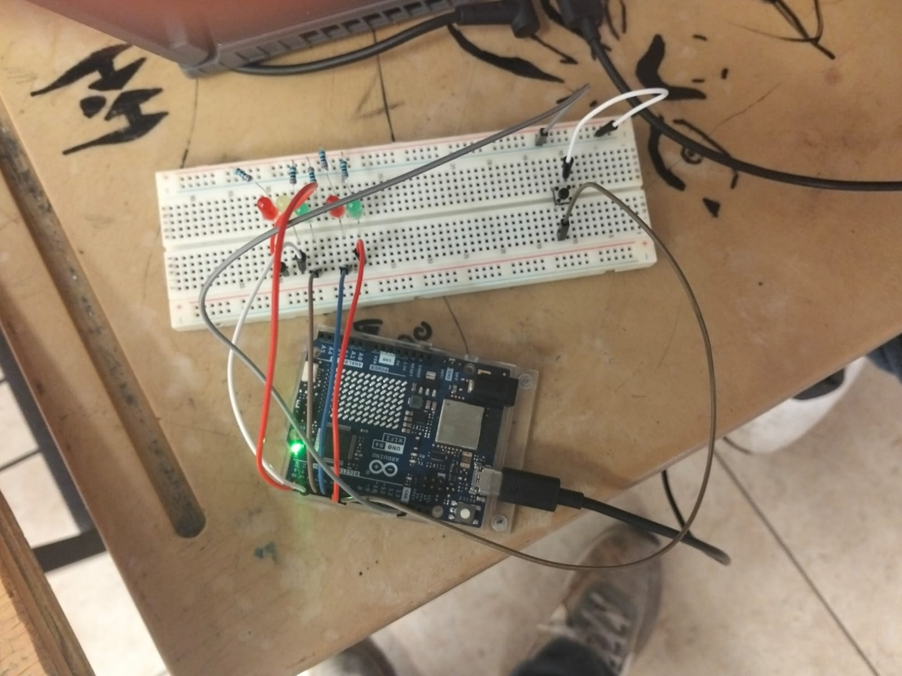

# Comparación entre delay() y millis() para el Control de Múltiples LEDs

## Descripción

Esta práctica tiene como propósito comparar dos formas de manejar el tiempo en Arduino mediante el uso de `delay()` y `millis()`. Se trabajó con tres LEDs con diferentes intervalos de parpadeo: 500 ms, 1000 ms y 1500 ms.

La primera parte utiliza `delay()`, mientras que la segunda utiliza `millis()` para realizar una temporización no bloqueante. También se incorporó una tarea adicional de impresión periódica por el puerto serie en la versión con `millis()`.

## Integrantes

* Javier
* Gabriel
* Rosa

## Objetivos

* Comprender el funcionamiento de `delay()` y `millis()`.
* Comparar una temporización bloqueante con una temporización no bloqueante.
* Controlar tres LEDs con diferentes intervalos de parpadeo.
* Observar el comportamiento de múltiples tareas dentro de un mismo programa.
* Comprender las ventajas de utilizar `millis()` cuando se necesitan ejecutar varias tareas de manera simultánea.

## Herramientas y material utilizado

* Arduino UNO R4 WiFi.
* Arduino IDE / Tinkercad.
* Protoboard.
* LED rojo.
* LED amarillo.
* LED verde.
* Resistencias limitadoras de corriente.
* Cables de conexión (jumpers).

## Diagrama

El diagrama muestra la conexión de los tres LEDs y los componentes utilizados para realizar la práctica.

 y millis().png)

[Ver carpeta Diagrama](Diagramas)

## Código

La práctica cuenta con dos versiones del programa. La primera utiliza `delay()` para controlar los intervalos de los LEDs, mientras que la segunda utiliza `millis()` para realizar el control sin bloquear la ejecución del programa.

[Ver código Parte 1 - delay()](Codigo/delay().ino)

[Ver código Parte 2 - millis()](Codigo/millis().ino)

[Ver carpeta Codigo](Codigo)

## Reporte

El reporte contiene la explicación del desarrollo de la práctica, la comparación entre `delay()` y `millis()`, el análisis del comportamiento de los LEDs y las conclusiones obtenidas.

[Ver Reporte](Reporte/Reporte.pdf)

## Resultados

Con `delay()`, los LEDs se encendieron y apagaron siguiendo una secuencia determinada por las pausas del programa. Debido a que `delay()` bloquea la ejecución durante el tiempo establecido, las demás instrucciones deben esperar a que termine cada pausa.

Con `millis()`, los tres LEDs pudieron trabajar con sus respectivos intervalos de 500, 1000 y 1500 ms sin detener completamente la ejecución del programa. Además, fue posible agregar la impresión del mensaje "Hola Mundo" cada 3000 ms mediante el monitor serie sin afectar el funcionamiento de los LEDs.

La comparación permitió observar las diferencias entre ambos métodos de temporización y el comportamiento de un programa cuando necesita realizar varias tareas dentro del mismo `loop()`.

## Video

Los videos muestran el funcionamiento de las dos versiones de la práctica, permitiendo observar la diferencia entre el uso de `delay()` y `millis()`.

[Ver video con delay()](https://www.youtube.com/watch?v=uhysPlJfVlU)

[Ver video con millis()](https://youtu.be/SooWojiCWjc)

[Ver carpeta Video](Video)

## Conclusiones

La práctica permitió comprender la diferencia entre el uso de `delay()` y `millis()` para controlar diferentes tareas en Arduino. Al comparar ambas implementaciones fue posible observar que `delay()` bloquea la ejecución del programa durante el tiempo establecido, mientras que `millis()` permite continuar ejecutando otras instrucciones.

El uso de `millis()` permitió controlar los tres LEDs con diferentes intervalos y agregar una tarea adicional mediante el monitor serie sin detener el funcionamiento de los demás elementos. Esto permitió comprender la importancia de la temporización no bloqueante para desarrollar programas capaces de realizar varias tareas dentro de un mismo sistema.
