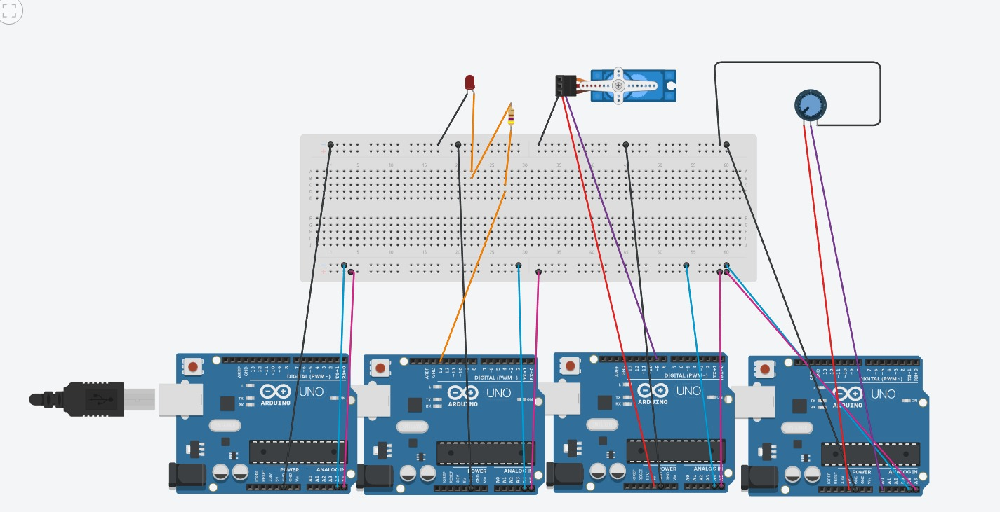

# Comunicación I2C entre 4 Arduinos

## Descripción

En esta práctica se implementó un sistema de comunicación mediante el protocolo I2C utilizando cuatro Arduino UNO R4 WiFi. Un Arduino funciona como maestro y los otros tres como esclavos, cada uno con una dirección diferente.

El maestro se comunica con los esclavos para controlar un LED, controlar un servomotor mediante un potenciómetro y mostrar los valores obtenidos mediante el Monitor Serie.

## Integrantes

* Gabriel
* Javier
* Rosa

## Objetivos

* Comprender el funcionamiento del protocolo de comunicación I2C.
* Implementar la comunicación entre un Arduino maestro y tres esclavos.
* Utilizar direcciones diferentes para identificar cada dispositivo.
* Enviar y recibir datos mediante el bus I2C.
* Controlar un LED y un servomotor mediante comunicación I2C.
* Leer un potenciómetro y utilizar su valor para controlar el servomotor.
* Utilizar `millis()` para realizar consultas periódicas sin bloquear el programa.

## Herramientas y material utilizado

### Hardware

* 4 Arduino UNO R4 WiFi
* 1 protoboard
* 1 LED
* 1 resistencia de 470 Ω
* 1 micro servomotor
* 1 potenciómetro
* Resistencias de 4.7 kΩ para SDA y SCL
* Cables de conexión
* Cables USB

### Software

* Arduino IDE
* Librería `Wire`
* Librería `Servo`
* Monitor Serie

## Diagrama

El sistema está compuesto por un Arduino maestro y tres Arduino esclavos conectados mediante el protocolo I2C.

Las líneas SDA y SCL son compartidas entre los cuatro Arduino y todos utilizan una tierra común. Cada esclavo tiene una dirección diferente: `0x08` para el LED, `0x09` para el servomotor y `0x0A` para el potenciómetro.

[Ver carpeta Diagrama](Diagrama)

## Código

El proyecto utiliza cuatro programas diferentes, uno para cada Arduino.

El **Arduino maestro** se encarga de comunicarse con los tres esclavos, recibir el valor del potenciómetro, convertirlo a un ángulo de 0° a 180° y enviarlo al servomotor. También permite controlar el LED mediante el Monitor Serie.

El **Esclavo 1** recibe una orden del maestro para encender o apagar el LED y utiliza la dirección `0x08`.

El **Esclavo 2** recibe el ángulo enviado por el maestro y controla el servomotor mediante el pin 9. Su dirección es `0x09`.

El **Esclavo 3** realiza la lectura del potenciómetro mediante A0 y envía el valor al maestro cuando este lo solicita. Su dirección es `0x0A`.

[Ver carpeta Código](Codigo)

## Reporte

En el reporte se explica el funcionamiento de la comunicación I2C entre los cuatro Arduino, la configuración del maestro y los esclavos, el control del LED, el servomotor y el potenciómetro, así como las consideraciones utilizadas para el Arduino UNO R4 WiFi.

[Ver reporte](Reporte/Reporte.pdf)

## Resultados

Durante la práctica se implementó la comunicación entre un Arduino maestro y tres esclavos mediante el protocolo I2C. Se trabajó con diferentes direcciones para cada dispositivo y se realizaron pruebas de comunicación para controlar los componentes conectados.

## Video

En el siguiente video se muestra el funcionamiento de la comunicación I2C entre los cuatro Arduino y el control de los dispositivos.

[Ver video de la práctica](https://youtu.be/xtoZlY5BY0I)

[Ver carpeta Video](Video)

## Conclusiones

La práctica permitió comprender el funcionamiento de la comunicación I2C utilizando un Arduino como maestro y tres como esclavos. Se aprendió cómo utilizar direcciones diferentes para establecer la comunicación con cada dispositivo mediante las líneas SDA y SCL.

También se comprendió cómo el maestro puede enviar órdenes y solicitar información a diferentes esclavos para controlar componentes como un LED y un servomotor, además de recibir la lectura de un potenciómetro.

En conjunto, la práctica permitió aplicar la comunicación entre múltiples dispositivos y comprender su utilidad para coordinar diferentes componentes mediante un mismo bus de comunicación.
