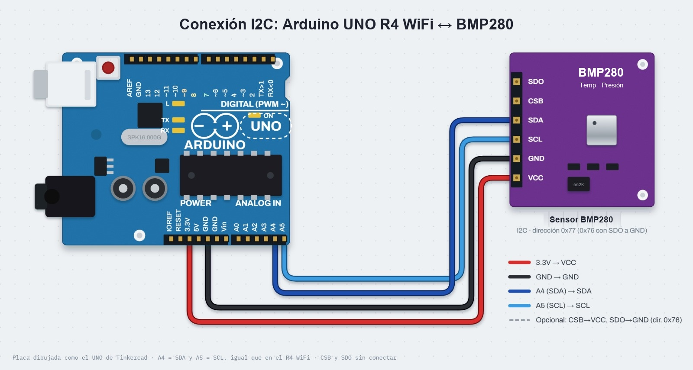
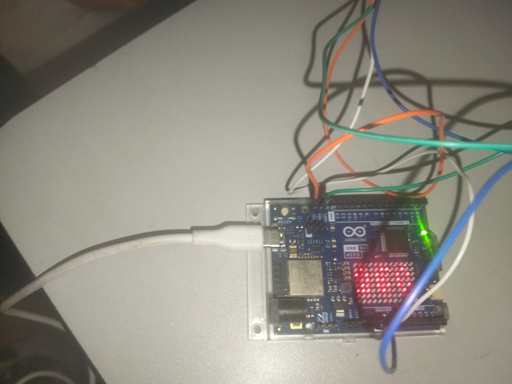
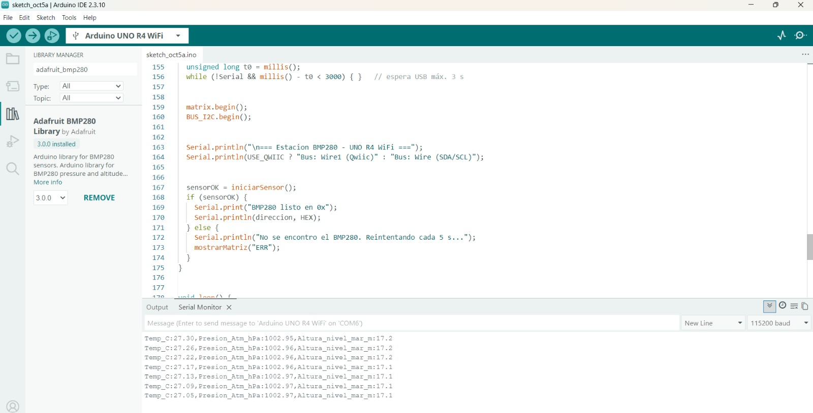

# Estación barométrica con sensor BMP280 por I2C

## Descripción

En esta práctica (P3.3) se implementó una estación barométrica utilizando un sensor BMP280 conectado a un Arduino UNO R4 WiFi mediante el protocolo de comunicación I2C.

El sistema lee la temperatura y la presión atmosférica, calcula la altitud aproximada respecto al nivel del mar y envía los valores por el puerto serie a 115200 baudios, en un formato compatible con el Serial Plotter. Además, la matriz de LEDs de 12x8 integrada en la placa alterna entre la temperatura (°C) y la altitud (m).

El programa utiliza `millis()` para temporizar todas las tareas sin bloquear la ejecución, e incluye la detección automática del sensor y el reintento de conexión cuando no responde.

## Integrantes

* Gabriel
* Javier
* Rosa

## Objetivos

* Conectar y configurar un sensor BMP280 mediante el protocolo I2C.
* Identificar el sensor por su dirección (`0x76` o `0x77`) y por su registro de identificación (Chip ID).
* Obtener la temperatura y la presión atmosférica, y calcular la altitud a partir de la presión.
* Mostrar las lecturas en el Monitor Serie y graficarlas con el Serial Plotter.
* Mostrar información en la matriz de LEDs integrada del Arduino UNO R4 WiFi.
* Utilizar `millis()` para ejecutar varias tareas periódicas sin bloquear el programa.
* Detectar lecturas inválidas o la desconexión del sensor y recuperar la comunicación.

## Herramientas y material utilizado

### Hardware

* Arduino UNO R4 WiFi
* Módulo sensor BMP280
* Protoboard
* Cables de conexión
* Cable USB-C

### Software

* Arduino IDE
* Librería `Adafruit BMP280 Library`
* Librería `Adafruit Unified Sensor`
* Librería `ArduinoGraphics`
* Librería `Arduino_LED_Matrix`
* Librería `Wire`
* Monitor Serie y Serial Plotter

## Diagrama

El sensor BMP280 se comunica con el Arduino mediante el bus I2C y se alimenta con **3.3 V**. Solo se necesitan cuatro cables:

| BMP280 | Arduino UNO R4 WiFi |
| ------ | ------------------- |
| VCC    | 3.3V                |
| GND    | GND                 |
| SDA    | A4 (SDA)            |
| SCL    | A5 (SCL)            |

Si se utiliza el conector Qwiic de la placa, se debe cambiar `USE_QWIIC` a `1` en el código para usar el bus `Wire1`.

[Ver carpeta Diagrama](Diagrama)

## Código

El programa busca el sensor en las direcciones `0x76` y `0x77` y lee el registro `0xD0` para comprobar que el Chip ID corresponde a un BMP280 (`0x58`). Después configura el sensor en modo normal con sobremuestreo y filtro IIR.

En el `loop()` se ejecutan dos tareas independientes controladas con `millis()`: la lectura del sensor cada 1000 ms y el cambio de pantalla de la matriz de LEDs cada 2500 ms. Si el sensor no responde o entrega una lectura inválida, la matriz muestra `ERR` y el programa reintenta la conexión cada 5000 ms.

[Ver código Estacion_BMP280.ino](Codigo/Estacion_BMP280.ino)

[Ver carpeta Código](Codigo)

## Reporte

En el reporte se explica el funcionamiento del sensor BMP280 mediante I2C, la detección del dispositivo por su Chip ID, el cálculo de la altitud a partir de la presión, el uso de la matriz de LEDs, la temporización con `millis()` y las pruebas realizadas durante la práctica.

[Ver reporte](Reporte/Reporte.pdf)

## Resultados

En el Monitor Serie se observan las lecturas de temperatura, presión atmosférica y altitud que se actualizan cada segundo. En la prueba se registraron alrededor de 27 °C, 1002.96 hPa y 17 m de altitud.

## Video

En el siguiente video se muestra el funcionamiento de la estación barométrica y la información mostrada en la matriz de LEDs.

[Ver video de la práctica](PEGAR_ENLACE_DEL_VIDEO)

[Ver carpeta Video](Video)

## Conclusiones

La práctica permitió comprender cómo se utiliza un sensor digital mediante el protocolo I2C, identificándolo por su dirección y por su registro de identificación antes de comenzar a leer sus datos.

También se comprendió que la altitud no se mide directamente, sino que se calcula a partir de la presión atmosférica, por lo que depende de la presión de referencia a nivel del mar que se defina en el programa.

Finalmente, el uso de `millis()` permitió leer el sensor, enviar los datos por el puerto serie y actualizar la matriz de LEDs con periodos distintos sin detener el programa, además de recuperar la comunicación cuando el sensor se desconecta.
